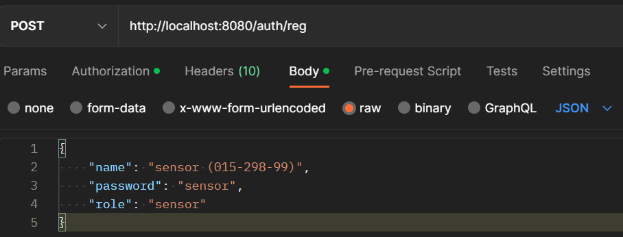
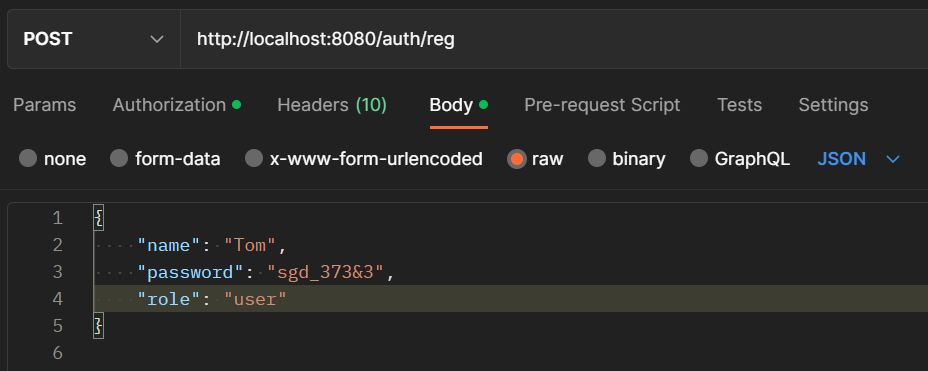
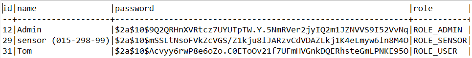
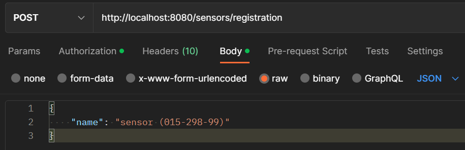
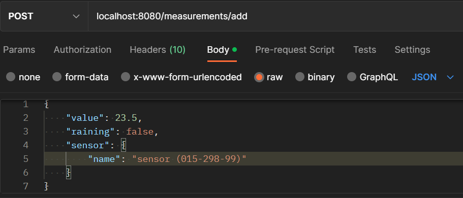
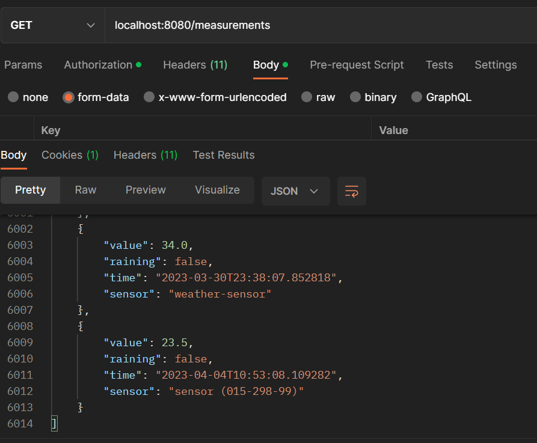
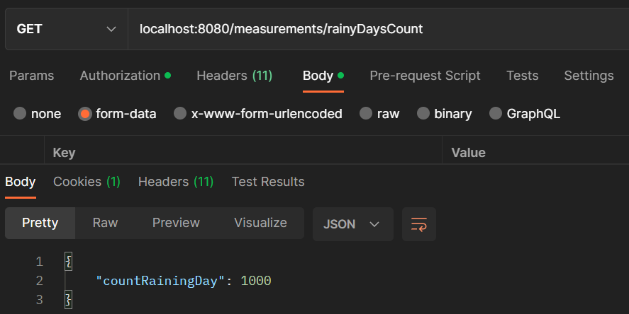

## Проект "REST API приложение"
### Описание:
Сервис принимает данные температуры воздуха, наличие/отсутствие дождя с указанием метеорологического датчика (сенсора) отправившего измерение.
Перед началом использования администратор регистрирует сенсор и учётную запись к нему, с помощью которой сенсор сможет отправлять данные. 
### Запросы к сервису:

1) POST /auth/reg

Регистрация нового пользователя/учётной записи сенсора в системе, выполняется только администратором (ROLE_ADMIN).

- Json:

    

- Json:

    

- БД:

    

2) POST /sensors/registration

Регистрация нового сенсора в системе (имя сенсора должно быть уникальным), выполняется только администратором (ROLE_ADMIN).

- Json:

    

3) POST /measurements/add

Добавление нового измерения (все поля валидируются).
Отправить измерение может только изначально зарегистрированный сенсор в базе (ROLE_SENSOR).

- Json:

    

4) GET /measurements

Возвращение всех измерений. Для доступа к измерениям пользователь должен быть аутентифицирован.

- Json:

    

5) GET /measurements/rainyDaysCount

Возвращает число дождливых дней за весь период.

- Json:

    

### Реализовано с использованием Spring Framework:
- Spring Core
- Spring MVC
- Spring Hibernate
- Spring Data JPA
- Spring Boot
- Spring Security
- Spring REST

База данных: PostreSQL

Liquibase